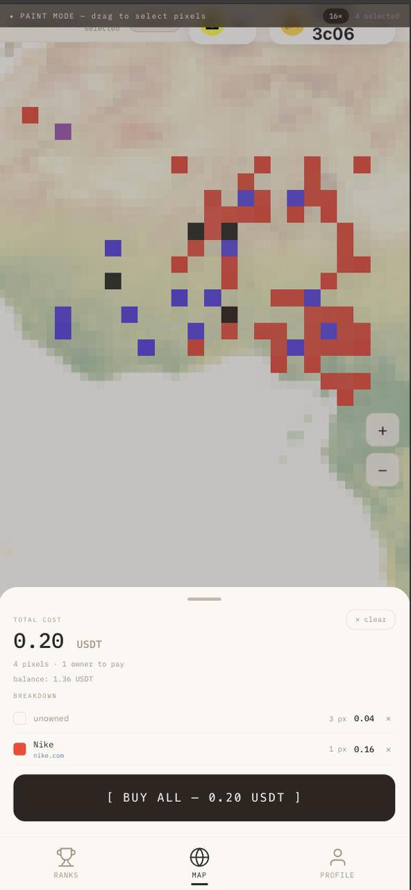
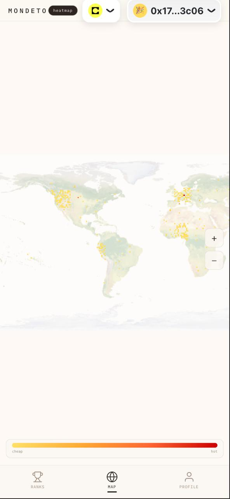
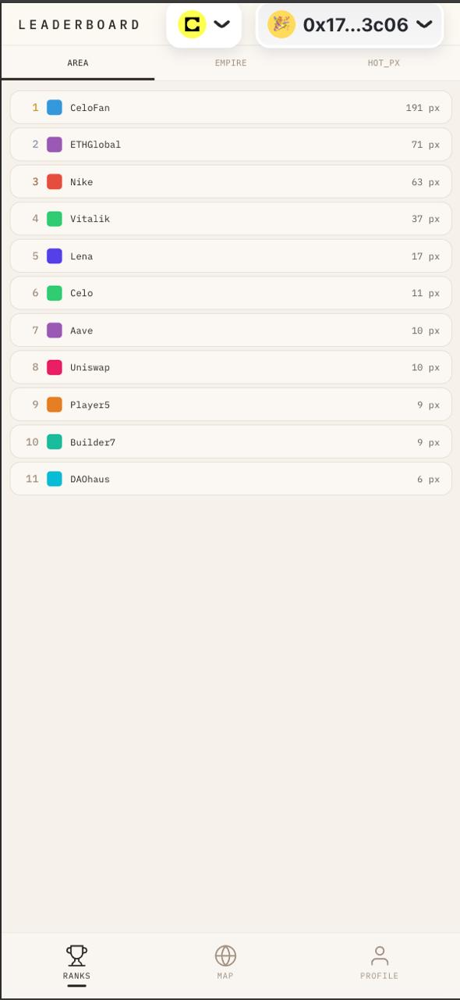
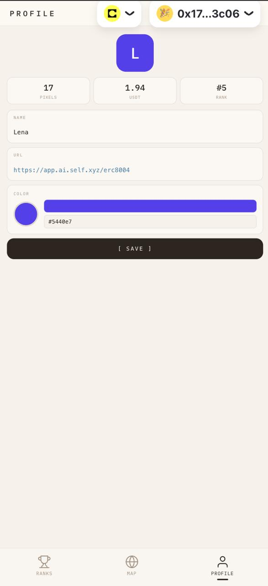

# Mondeto

**Own the world, one pixel at a time.**

Mondeto (Esperanto for "small world") is a pixel world map where anyone can buy, own, and trade land on a 170x100 pixel grid. Built for [MiniPay](https://www.opera.com/products/minipay) on the [Celo](https://celo.org) blockchain.

**Live demo:** [mondeto-fe.vercel.app](https://mondeto-fe.vercel.app)
**Smart contract:** [github.com/karlb/mondeto](https://github.com/karlb/mondeto)

## Screenshots

| Map | Heatmap | Leaderboard | Profile |
|-----|---------|-------------|---------|
|  |  |  |  |

## How It Works

1. **Zoom in** to the dot-matrix world map and enter paint mode (4x zoom)
2. **Select pixels** on any continent — water is not selectable (enforced on-chain)
3. **Review your selection** — see total cost, balance, and breakdown by current owner
4. **Buy land** — pay in USDT on Celo. Price doubles with each sale, halves every 182 days without resale.
5. **Customize** — set your name, website URL, and color on your profile (stored on-chain)
6. **Climb the leaderboard** — ranked by total area, largest empire (contiguous territory), or most expensive pixel

## Features

- **Dot-matrix world map** — 170x100 pixel grid rendered as rounded rectangles, no background image
- **Dark/light mode** — neon green on black (default) or cream palette, toggle in top bar
- **On-chain data** — all pixel ownership, profiles, and prices read from the Mondeto smart contract
- **Land mask from contract** — fetched via `getLandMask()`, only land pixels are purchasable
- **Real buy flow** — USDT approve + `buyPixels()` with balance check and error handling
- **Profile system** — name, URL, color stored on-chain via `updateProfile()`
- **Leaderboard** — AREA, EMPIRE (BFS contiguous), HOT_PX tabs with profile names and clickable URLs
- **Heatmap mode** — yellow/orange/red gradient showing price hotspots
- **Wallet integration** — RainbowKit for browser, auto-connects in MiniPay
- **Mock fallback** — works without wallet/contract for development

## Smart Contract

The Mondeto contract is a UUPS upgradeable proxy on Celo:

- **Grid:** 170x100 (17,000 pixels, ~5,622 land)
- **Pricing:** `initialPrice << (saleCount - epoch)` with 182-day halving
- **Payment:** Single ERC20 token (USDT), unowned pixels pay treasury, owned pixels pay previous owner
- **Profile:** `{ color: uint24, label: bytes64, url: bytes64 }` per address
- **Land mask:** Bit-packed `uint256[]`, immutable after deploy

**Sepolia:** `0x63a514b04b0eff231d26837790690e1dd4010e7d`

## Getting Started

```bash
# Install dependencies
pnpm install

# Start dev server
pnpm dev

# Run tests
pnpm --filter web test

# Type check
pnpm --filter web type-check
```

Open [http://localhost:3000](http://localhost:3000) in your browser.

## Project Structure

```
apps/
  web/                    Next.js 14 app
    src/
      app/                Pages (/, /ranks, /profile, /test-contract)
      components/
        Map/              WorldCanvas, PixelLayer, SelectionLayer, HeatmapLegend, PaintModeBanner
        Overlays/         SelectionDrawer, PixelInfoPanel, DimLayer, TxProgress, SuccessState
        Layout/           TopBar, BottomNav, ScreenHeader, ZoomHintToast
        Leaderboard/      LeaderboardTabs, LeaderboardRow
        Profile/          AvatarBlock, StatsRow, ColorPicker
      hooks/              usePixelMap, useSelection, usePixelPrice, useBuyPixels, useLeaderboard, useProfile, useUSDTBalance
      lib/                contract.ts (ABI), contractReads.ts, priceCalc.ts, landMask.ts, mock.ts, theme.tsx, decodeBytes.ts
      constants/          map.ts (grid dimensions, colors, prices)
      data/               landMask.ts (static fallback, auto-fetched from contract at runtime)
      __tests__/          Vitest tests
  contracts/              Mondeto.sol (reference copy)
scripts/
  convert-land-mask.py    Convert contract uint256 words to frontend format
```

## Tech Stack

- **Framework:** Next.js 14 (App Router)
- **Language:** TypeScript
- **Styling:** Tailwind CSS + CSS variables (dark/light theme)
- **Canvas:** HTML5 Canvas API with react-zoom-pan-pinch
- **Wallet:** wagmi + viem + RainbowKit
- **Chain:** Celo Mainnet / Celo Sepolia
- **Smart Contract:** Solidity, UUPS proxy (OpenZeppelin v5)
- **Testing:** Vitest + React Testing Library
- **Monorepo:** Turborepo + pnpm
- **Deployment:** Vercel

## Design

- **Font:** IBM Plex Mono (400, 500)
- **Dark mode (default):** Black (#0a0a0a), neon green (#00ff41) accents
- **Light mode:** Cream (#fdf9f4), dark text (#1a1a1a)
- **Map:** Dot-matrix — Equal Earth projection, rounded rectangle tiles
- **Grid:** 170x100 pixels, gap 0.08, radius 0.12, paint mode at 4x zoom

## License

MIT
